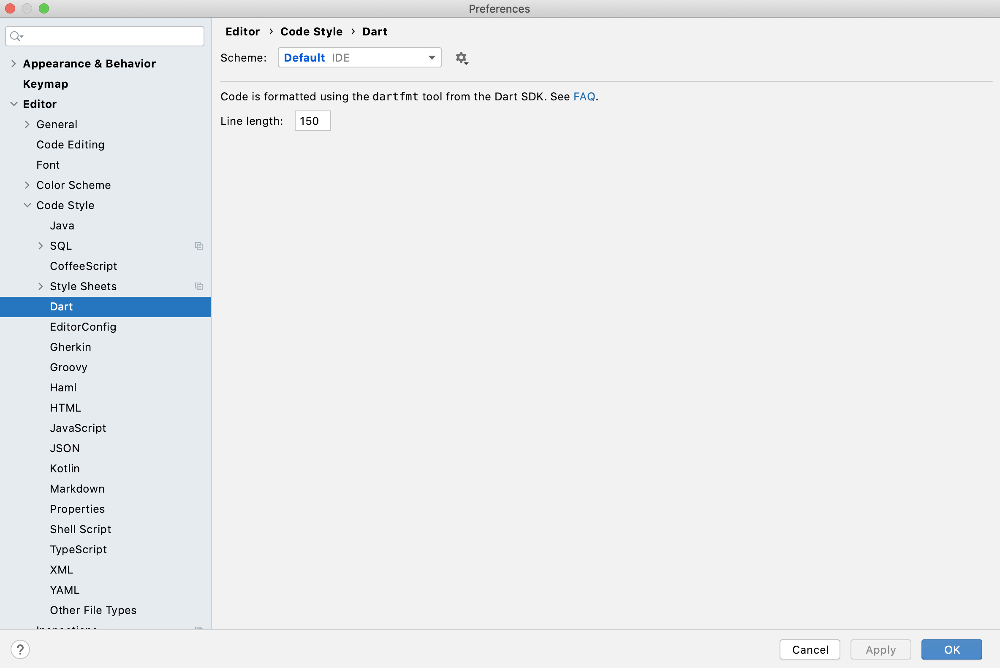

# 1 修改Mac 截图的默认保存位置

```
# 1 设置
defaults write com.apple.screencapture location /Users/yuri/workspace/idea/dart_study/doc/assets

# 2 重启服务
killall SystemUIServer
```

# 2 line length of the dart code



